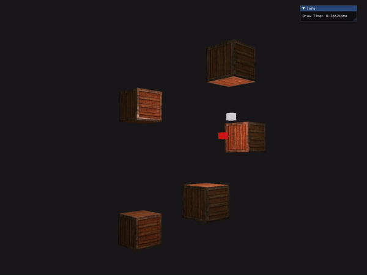
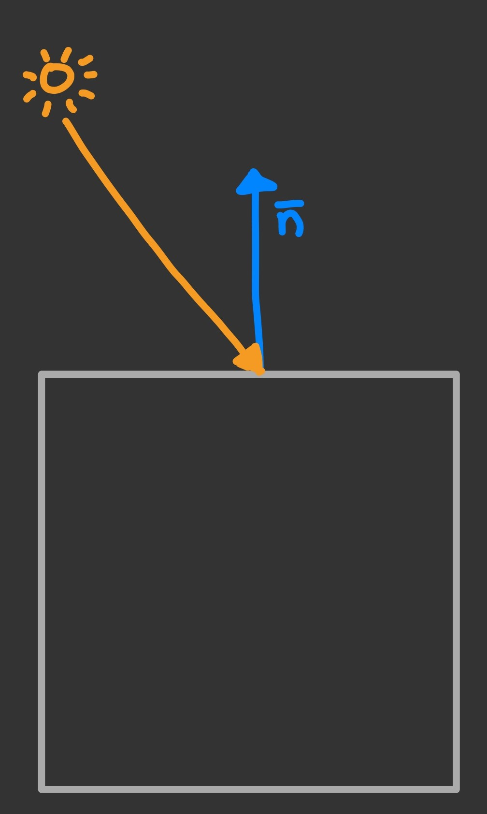
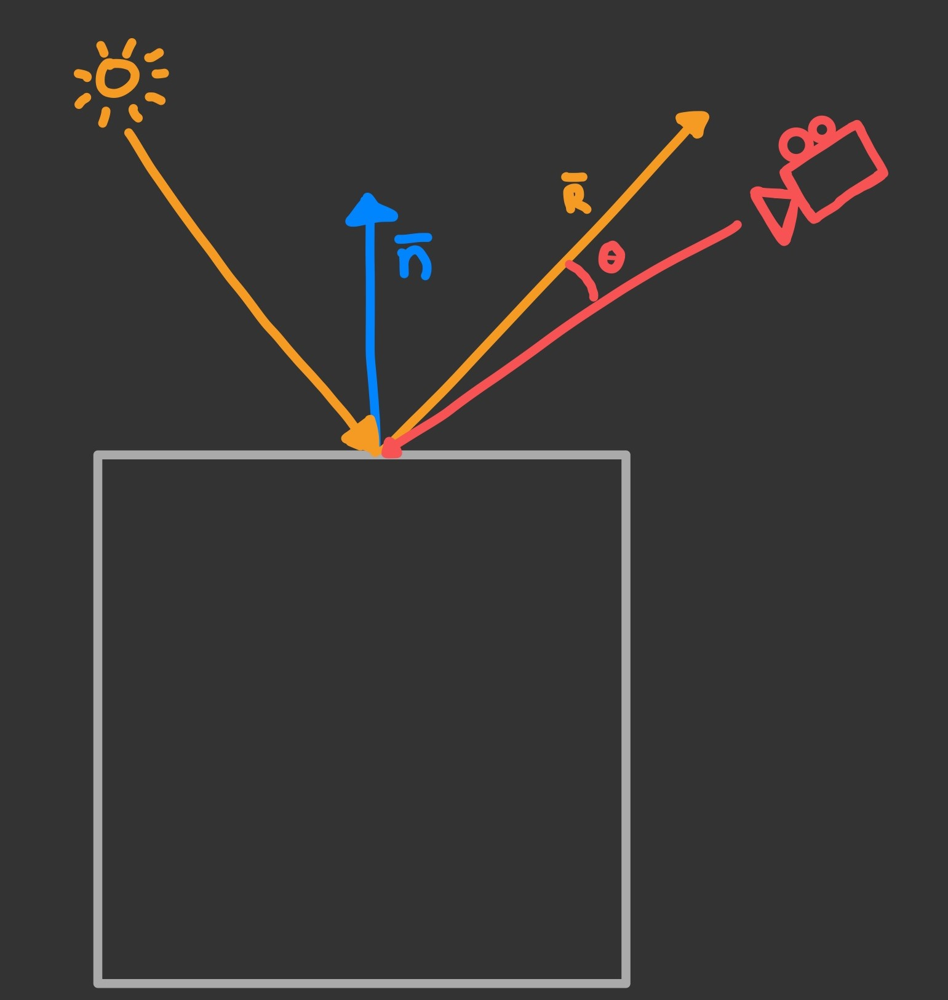

# nanoRenderer (OpenGL)

This is a minimal Renderer I built in C++ with the OpenGL API.

## Overview

- [x] [Phong Lighting](#phonglighting)
- [x] [Moving Camera](#movingcamera)
- [x] [Textures](#textures)
- [x] [Diffuse and Specular Maps](#textures)

## Features 

## <a name="phonglighting">Phong Lighting</a>
Implemented diffuse lighting in the shader which shades fragments based on the degree between light vector and normal vector (see Figure 1). 

*Figure 1 - Phong Diffuse Lighting*

Also implemented specular lighting in the shader which shades fragments based on the degree between the refelcted light vector and the camera vector (see Figure 2).

*Figure 2 - Phong Specular Lighting*

## <a name="movingcamera">Moving Camera</a>
Implemented a fully movable camera (standard WASD movement and mouse input). 

## <a name="textures">Diffuse & Specular Maps & Textures</a>

Diffuse and Specular maps are implemented as a header only class that reads multiple file formats (using the [stb](https://github.com/nothings/stb) library). The implementation of the Shader class can be found here [Shader.h](./OpenGLRenderer/shader/Shader.h).

## Work in Progress
- [ ] Model Loading
- [ ] Advanced Lighting
